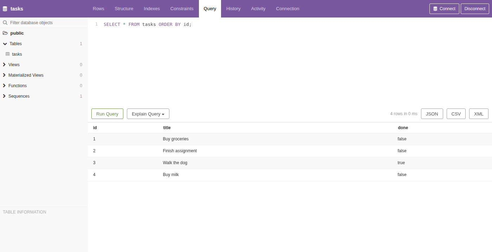

# Task API — CRUD on PostgreSQL, in Docker

A small backend API that manages a to-do list: create, read, update, and delete tasks. Built with **Node.js** and **Express**, storing its data in **PostgreSQL** running in a **Docker** container.

The whole stack — the API and its database — starts with one command.

This is the same API from Assignment 1, on its third storage engine. The endpoints have never changed:

| Assignment | Where tasks live | What runs it | Survives a restart? |
|---|---|---|---|
| A1 | a list in memory | the Node process | No |
| A2 | a `tasks.db` file | SQLite, on disk | Yes, unless the file is deleted |
| **A3 (this one)** | **rows in Postgres** | **a container, with a volume** | **Yes, across app *and* container restarts** |

## Run it

You need [Docker Desktop](https://www.docker.com/products/docker-desktop/) (or Podman). Nothing else — no Node install, no Postgres install.

```bash
cp .env.example .env
docker compose up
```

That's it. The API is on **http://localhost:3000**, interactive docs on **http://localhost:3000/docs**.

On the very first run Docker downloads the Postgres image, the database creates itself, the `tasks` table is created, and 3 example tasks are inserted. Every run after that reuses what's already there.

To stop: `Ctrl+C`, then `docker compose down`. Your data stays (see [Persistence](#persistence)).

### Which variables to set

Everything lives in `.env`, which is **git-ignored** — the real password is never committed. `.env.example` is committed as the template, and `cp .env.example .env` gives you working defaults for local development:

| Variable | What it's for |
|---|---|
| `POSTGRES_USER` | database user Postgres creates on first boot |
| `POSTGRES_PASSWORD` | that user's password |
| `POSTGRES_DB` | database name (`tasks`) |
| `DATABASE_URL` | how the API reaches the database |

`DATABASE_URL` is only used when you run the API directly on your machine with `npm start`. Inside `docker compose`, the API gets its connection string from `compose.yaml`, where the host is the **service name `db`** rather than `localhost` — inside a container, `localhost` means the container itself, which has no database in it.

### Running the API outside Docker (optional)

Useful while developing. Start just the database in Docker, then run the app on your machine:

```bash
docker run --name taskdb -e POSTGRES_PASSWORD=dev -e POSTGRES_DB=tasks \
  -p 5432:5432 -v taskdata:/var/lib/postgresql/data -d postgres

npm install
npm start
```

## Endpoints

| Method | Path | Description | Success | Errors |
|---|---|---|---|---|
| GET | `/` | API description | 200 | — |
| GET | `/health` | Health check — also pings the database | 200 | 503 if the database is unreachable |
| GET | `/tasks` | List all tasks | 200 | — |
| GET | `/tasks/:id` | Get one task | 200 | 404 unknown id |
| POST | `/tasks` | Create a task (`{ "title": "..." }`) | 201 | 400 missing/empty title |
| PUT | `/tasks/:id` | Update a task's title and/or `done` | 200 | 400 invalid body, 404 unknown id |
| DELETE | `/tasks/:id` | Delete a task | 204 | 404 unknown id |

Every error returns JSON with an `error` message.

### Example: creating a task

```
curl -i -X POST http://localhost:3000/tasks -H "Content-Type: application/json" -d '{"title":"Buy milk"}'
```

```
HTTP/1.1 201 Created
X-Powered-By: Express
Content-Type: application/json; charset=utf-8
Content-Length: 40
ETag: W/"28-gPXr/tBcmKMXZwSEhav9o8e9gYc"
Date: Fri, 21 Aug 2026 04:37:56 GMT
Connection: keep-alive
Keep-Alive: timeout=5

{"id":5,"title":"Buy milk","done":false}
```

## The data, in the database

The same rows the API serves, seen directly in Postgres through a database GUI — including "Buy milk", which was created through `POST /tasks`:



The same thing from the command line, without leaving Docker:

```
$ docker compose exec db psql -U postgres -d tasks -c "\dt"
         List of relations
 Schema | Name  | Type  |  Owner
--------+-------+-------+----------
 public | tasks | table | postgres
(1 row)

$ docker compose exec db psql -U postgres -d tasks -c "SELECT * FROM tasks ORDER BY id;"
 id |       title       | done
----+-------------------+------
  1 | Buy groceries     | f
  2 | Finish assignment | f
  3 | Walk the dog      | t
  4 | Buy milk          | f
(4 rows)
```

## Persistence

The database container mounts a **named volume** (`taskdata`). A volume is disk space that lives outside the container, so removing the container doesn't remove the data.

The check:

```bash
docker compose up -d
curl -X POST http://localhost:3000/tasks -H "Content-Type: application/json" -d '{"title":"survive me"}'

docker compose down      # stops AND removes both containers
docker compose up -d     # brand new containers

curl http://localhost:3000/tasks   # "survive me" is still in the list
```

The containers that wrote the row no longer exist, and the row is still there. That is what the volume line in `compose.yaml` buys — delete it and this same test wipes your data every time.

## How it's put together

```
server.js           # routes, validation, status codes - no SQL at all
taskRepository.js   # every task query lives here (the repository)
db.js               # connection pool, waits for Postgres, creates + seeds the table
compose.yaml        # api + db as one stack
Dockerfile          # how the api image is built
.env.example        # template for .env (which is git-ignored)
openapi.json        # spec behind Swagger UI at /docs
```

### About "only the storage layer changed" — honestly

The point of this assignment is that swapping storage shouldn't ripple through the app. Here's the honest version of what happened:

**What genuinely did not change:** the API's behaviour. Same paths, same methods, same request bodies, same response shapes, same status codes (`200/201/204/400/404`), same validation rules, same error messages. The A1 and A2 `curl` commands still pass, unchanged, against Postgres. A client cannot tell which of the three storage engines is behind the API — that's the real proof, and it's why "storage is an implementation detail" is more than a slogan.

**What did change, and why:** in A2 the SQL was written inline inside the route handlers, so the routes were not cleanly separated from storage yet. This assignment fixed that: all database access moved into `taskRepository.js`, and the route bodies changed shape twice over — once to call the repository instead of running queries themselves, and once to become `async`, because the Postgres driver returns promises where `better-sqlite3` was synchronous.

So it would be dishonest to claim the routes were untouched this time. What is true is that **they now sit behind an interface** (`listTasks`, `getTask`, `createTask`, `updateTask`, `deleteTask`), and swapping the database *again* would mean rewriting `taskRepository.js` and nothing else. That's the layering the assignment is pointing at, and formalising it further is A15's job.

### Safety and correctness notes

- **Parameterized queries everywhere.** Values go to Postgres as `$1`, `$2` parameters, never glued into the SQL string — user input can't be executed as SQL.
- **Seeding is a transaction.** The 3 example tasks are inserted inside `BEGIN`/`COMMIT`, so seeding is all-or-nothing rather than leaving a half-filled table behind if something fails midway.
- **The app waits for the database.** When a whole stack starts at once, the API is often ready before Postgres is. `compose.yaml` uses a health check so the API only starts once Postgres actually answers, and `db.js` retries on top of that, so `docker compose up` works on the first try instead of crashing in a race.
- **`RETURNING *`** on insert/update hands back the row Postgres just wrote in the same round trip, instead of a second `SELECT`.
- **The secret never reaches the image.** `.env` is in both `.gitignore` and `.dockerignore`, so the password isn't committed to git and isn't baked into the Docker image either.

## Stages (git history)

**Assignment 1 — in-memory CRUD API**

1. Hello server
2. Root + health endpoints
3. Read endpoints (list, single, 404)
4. Create endpoint with validation
5. Update + delete endpoints (full CRUD)
6. Swagger UI at `/docs`
7. README + docs

**Assignment 2 — SQLite**

8. Create SQLite database (table + one-time seed)
9. Database read endpoints
10. Insert into database
11. Update and delete with SQL
12. Explored SQLite by hand — see [`sql-notes.md`](sql-notes.md)
13. Database documentation

**Assignment 3 — Postgres in Docker**

14. Postgres in Docker + gitignore
15. Connect via `.env` and create table
16. Read from Postgres
17. Full CRUD on Postgres
18. docker-compose the whole stack
19. One-command stack + docs
