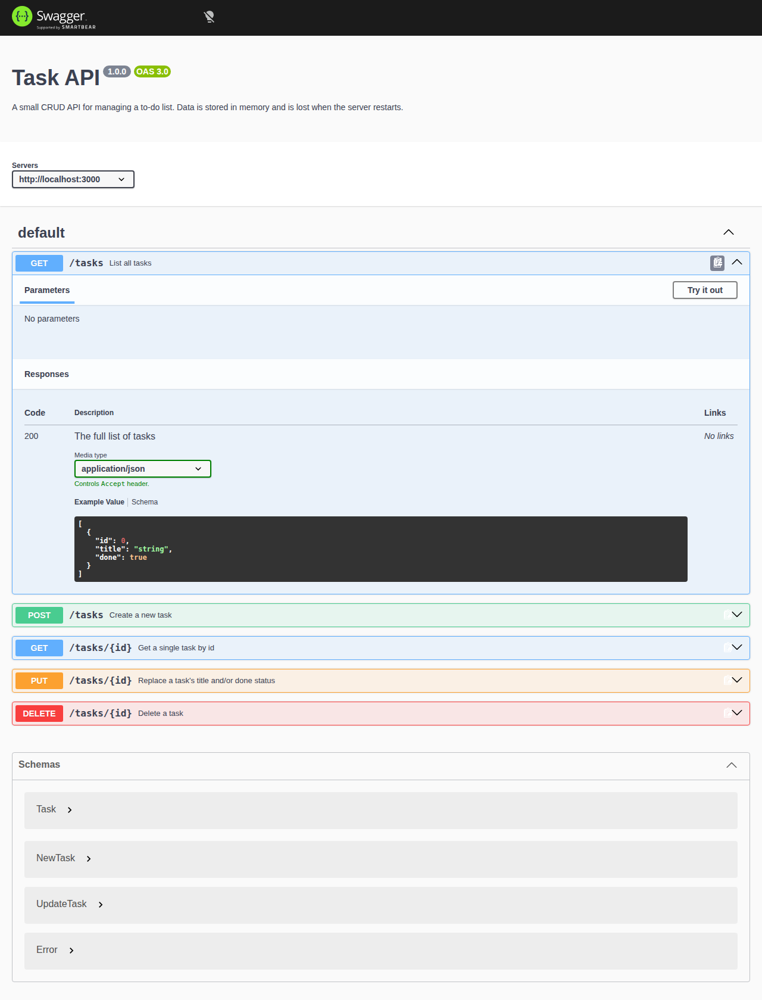
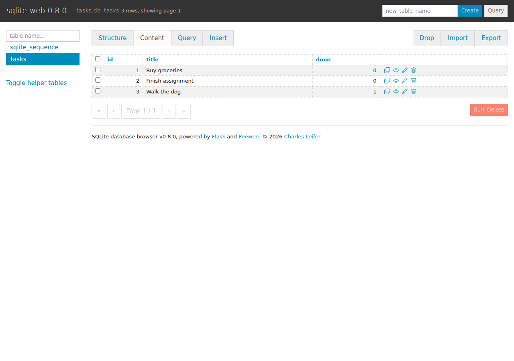

# Task API — my first CRUD API

A small backend API that manages a to-do list: create, read, update, and delete tasks — the four CRUD operations. Built with **Node.js** and **Express**.

Data is stored in a real **SQLite** database (`tasks.db`), so it survives server restarts. Interactive docs are available through **Swagger UI**, generated from a hand-written OpenAPI spec (`openapi.json`).

## How to run it

```bash
npm install
npm start
```

The server starts on **http://localhost:3000**. Visit `http://localhost:3000/docs` for interactive Swagger docs.

The first time you run it, `tasks.db` doesn't exist yet — the app creates the file, creates the `tasks` table, and seeds it with 3 example tasks automatically. On every run after that, it detects the table already has data and leaves it alone, so restarting never duplicates the seed data or wipes what you added.

## Endpoints

| Method | Path | Description | Success | Errors |
|---|---|---|---|---|
| GET | `/` | API description | 200 | — |
| GET | `/health` | Health check | 200 | — |
| GET | `/tasks` | List all tasks | 200 | — |
| GET | `/tasks/:id` | Get one task | 200 | 404 if id doesn't exist |
| POST | `/tasks` | Create a task (`{ "title": "..." }`) | 201 | 400 if title missing/empty |
| PUT | `/tasks/:id` | Update a task's title and/or `done` | 200 | 400 invalid body, 404 unknown id |
| DELETE | `/tasks/:id` | Delete a task | 204 | 404 if id doesn't exist |

Same endpoints, same request/response shapes as Assignment 1 — only the storage underneath changed.

## Example: creating a task

```
curl -i -X POST http://localhost:3000/tasks -H "Content-Type: application/json" -d '{"title":"Buy milk"}'
```

```
HTTP/1.1 201 Created
X-Powered-By: Express
Content-Type: application/json; charset=utf-8
Content-Length: 40
ETag: W/"28-PpSBYV7i68cXyGc7AhjVpkZkY5Q"
Date: Thu, 20 Aug 2026 04:40:20 GMT
Connection: keep-alive
Keep-Alive: timeout=5

{"id":4,"title":"Buy milk","done":false}
```

## Swagger UI

`/docs` lists all five endpoints and lets you run the full CRUD cycle with "Try it out" — no curl needed.



## The database

**Why SQLite:** it's a single file on disk with no separate database server to install, configure, or keep running — perfect for a small project where the point is learning how an API talks to a database, not managing database infrastructure. The `better-sqlite3` library gives synchronous queries, so the route handlers read almost exactly like the in-memory version from Assignment 1 — `db.prepare(...).run()` instead of `array.push()`.

**Where the file lives:** `tasks.db`, in the project root, next to `server.js`. It's gitignored — nobody clones a database full of someone else's test data, they get a fresh one created automatically on first run (see "How to run it" above).

**Schema:**

```sql
CREATE TABLE IF NOT EXISTS tasks (
  id INTEGER PRIMARY KEY AUTOINCREMENT,
  title TEXT NOT NULL,
  done INTEGER NOT NULL DEFAULT 0
);
```

(SQLite has no native boolean type, so `done` is stored as `0`/`1` and converted to `true`/`false` at the API boundary.)

**Database viewer:** I opened `tasks.db` with `sqlite-web`, a browser-based SQLite browser, to inspect the schema and rows directly, outside the app.



**One example query I ran directly against the database, with the server still running:**

```sql
UPDATE tasks SET done = 1;
```

I ran this in a separate script against `tasks.db` — not through the API — and then called `GET /tasks` again without restarting the server. All three tasks came back with `"done": true`. The API doesn't cache anything; it queries the database fresh on every request, so a change made completely outside the app shows up immediately. Full walkthrough with every query I ran (`SELECT`, `WHERE`, `COUNT`, `UPDATE`, `DELETE`) is in [`sql-notes.md`](sql-notes.md).

## Data survives a restart now

Create a task, stop the server (`Ctrl+C`), run `npm start` again, then `GET /tasks` — the task is still there. In Assignment 1 this same test proved data was lost; here it's the opposite proof: the database file on disk is the source of truth, not anything held in the Node process's memory.

## Project structure

```
server.js       # the API - routes, validation, SQL queries
db.js           # opens/creates tasks.db, creates the table, seeds it once
openapi.json    # hand-written OpenAPI spec that powers Swagger UI at /docs
sql-notes.md    # manual SQL queries run directly against the database (Stage 4)
package.json
```

## Stages (git history)

**Assignment 1 — in-memory CRUD API**

1. Hello server
2. Root + health endpoints
3. Read endpoints (list, single, 404)
4. Create endpoint with validation
5. Update + delete endpoints (full CRUD)
6. Swagger UI at `/docs`
7. README + docs

**Assignment 2 — connected to SQLite**

8. Create SQLite database (table + one-time seed)
9. Database read endpoints (`GET /tasks`, `GET /tasks/:id`)
10. Insert into database (`POST /tasks`)
11. Update and delete with SQL (`PUT`/`DELETE /tasks/:id`)
12. Explored SQLite manually — see `sql-notes.md`
13. Database documentation (this README)
